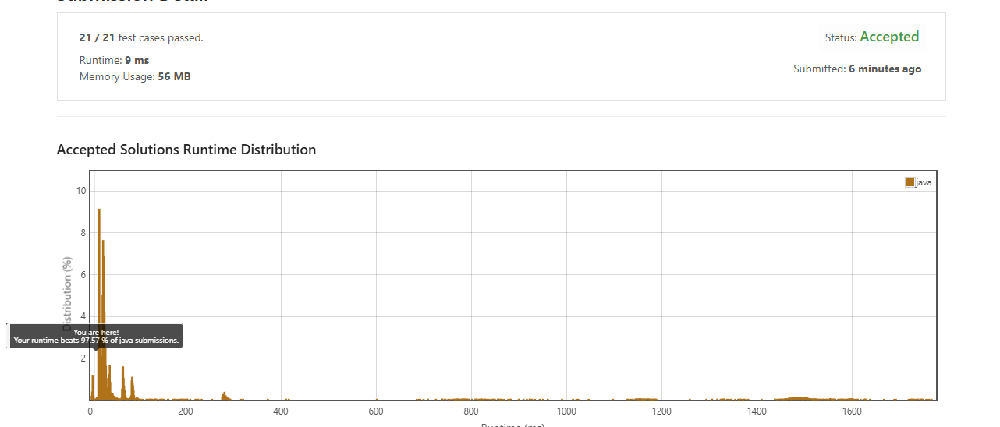

# Jump Sort Algorithm

--

--

## 🧠 Overview
**Jump Sort** is a custom-built, bucket-based sorting algorithm developed to handle both **negative** and **non-negative** integers efficiently. Designed with simplicity and speed in mind, JS avoids comparisons entirely and places values directly into their appropriate positions — making it ideal for educational use and mid-semester sorting epiphanies.

Unlike its predecessor, Juggle Sort, this version is actually **efficient** — proof that sometimes even winter-semester chaos can produce a useful outcome.

---

## ⚙️ Algorithm Description

Jump Sort works by:

1. **Splitting** the input list into negatives and non-negatives.
2. **Mapping** each number into a bucket using its value as an index:
   - Negatives are handled using `abs(num)` and reversed to preserve order.
   - Non-negatives use direct value indexing (e.g., `index = num`).
3. **Flattening** both bucket lists into a single sorted output.

This results in a sorted list with **preserved duplicates**, **no comparisons**, and **fast execution** when the value range is reasonable.

> 💡 Note: The algorithm uses extra memory, so it's best suited for lists where values fall within a manageable range (e.g., -1000 to 1000).

---

## ✨ Why “Jump Sort”?

Because values don’t crawl or swap into place — they **jump** straight to where they belong, like they're magnetically pulled into order.

Also, it keeps the **JS initials** for ✨personal branding✨ (*Jaspreet Singh*), which may or may not increase my GitHub aura.

---

## 📉 Performance Considerations

- **Time Complexity:** O(n + k)  
  Where `n` is the number of items and `k` is the range of values  
- **Space Complexity:** O(n + k)
- **Scales well** for moderate-sized lists with small-to-moderate value ranges

> ❌ Not ideal for sorting integers in extreme ranges (e.g., -1,000,000 to 1,000,000)

---

## 😅 Backstory

Created after reflecting on the pain of Juggle Sort's inefficiencies, Jump Sort was born out of the realization that you can avoid all comparisons if you **just think in buckets**. It’s simple. It’s fast. And for once, it actually works better under pressure.

You might still question why this was made — and if so, rest assured: winter semester was over and I was starting to get comfortable.

---

## 🔧 Future Improvements

- Dynamically manage buckets using `dict()` to reduce space usage
- Add support for floating point numbers using bucket ranges
- Port to C/C++ for better performance in low-level environments
- Create visualizations for better understanding of how data “jumps” into place

---

## 📄 License

Distributed under the **MIT License**.  

See the full license in [`LICENSE`](LICENSE).

---

## 👤 Author

**Jaspreet Jawanda**  
- 📧 [jawa3252@mylaurier.ca](mailto:jawa3252@mylaurier.ca), [Jaspreet4444@outlook.com](mailto:Jaspreet4444@outlook.com)  
- 💻 GitHub: [@sayanwala4](https://github.com/sayanwala4)  
- 💼 LinkedIn: [jaspreet singh jawanda](https://www.linkedin.com/in/jaspreet-jawanda/)  
- 🌐 Website: [JJawanda.me](https://www.jjawanda.me/)

---

## 🖼 Visualization

---

## 🙋‍♂️ Contact

Feel free to reach out if you:
- Want to implement this in another language
- Have optimization ideas
- Just want to say, “Hey, this is actually kinda cool.”

---

## ✅ LeetCode Submission

Here's a successful test of Jump Sort logic adapted into a LeetCode-style submission environment.

---
